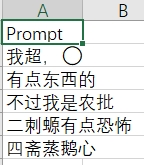
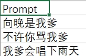

## 项目功能&目的

Dify站的自动化Prompt测试,节约Prompt2Completions测试时间
方便Prompt工程师评测Prompt的效果,节约等待的时间

## 项目使用方法

Step1.安装必备的库以及selenium自动化环境

Step2.在excel表里面进行填写所有要测试的Prompt多轮对话,
一个csv文件对应一次多轮对话

Step3.在脚本里面输入你要测试的dify网站链接

运行脚本后,等待片刻,就可以在你的dify网站通过 Logs&Ann 看到结果

运行后Prompt1.csv对应的是

Prompt2.csv对应的是

## 项目演示视频

[演示视频](video_show)

## 项目正在优化的点

### 1.结果展示优化

在Excel里面新增一个Completions列
将Completions直接展示在里面

这样就不用通过dify站的Logs&Ann 看结果了

### 2.Prompt评测功能加入

通过Prompt_Completions的结果,进行效果评测
[效果评测的依据的项目链接](https://github.com/Formyselfonly/PromptEval)